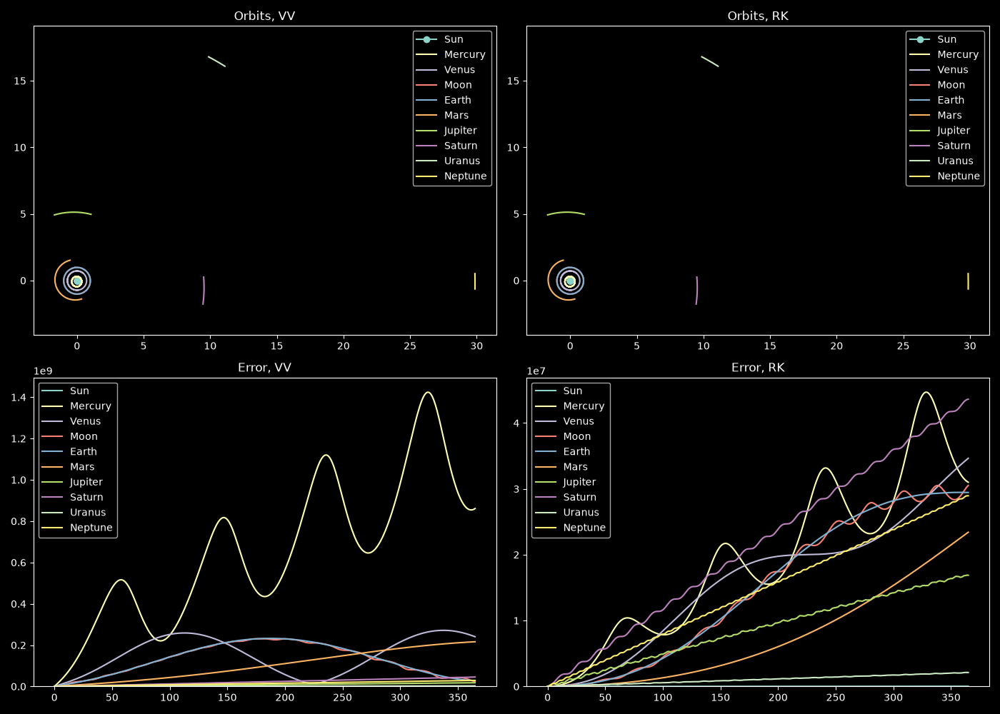

# Orbital N-Body Simulation

A Python-based N-body motion simulator, designed to model planetary motion using solvers like Verlet Velocity and Runge-Kutta 45 and compare the
results to the ephimeris fetched from NASA JPL's Horizon API.

---

## Features

* **Real-time Ephemeris Fetching:** Automated data retrieval from the NASA JPL Horizons REST API with local caching.
* **Numerical Integrators:** Implements locally **Verlet Velocity** and relies on the SciPy library for **RK45** and **DOP853**.
* **Trajectory Visualization:** 2D trajectory plots generated using Matplotlib.

---

## Examples

Here are some sample output plots generated by the simulation:

### 1 year Simulation

### 5 year Simulation

### 20 year Simulation

In all plots, the error is displayed below the corresponding trajectory plots and is measured in meters, while the x-axis indicates the
number of days of the simulation. It can be seen that the accumulation of error for both is rather different between the different planets.

---

## Structure

* `main.py` – main script for plotting and calling of API and integrator function
* `API_functions.py` – API handlers for fetching and caching data from the Horizon website
* `classes.py` – core `CelestialObject` classes and constants
* `integrators.py` – numerical integrators
* `requirements.txt` – list of required Python packages.